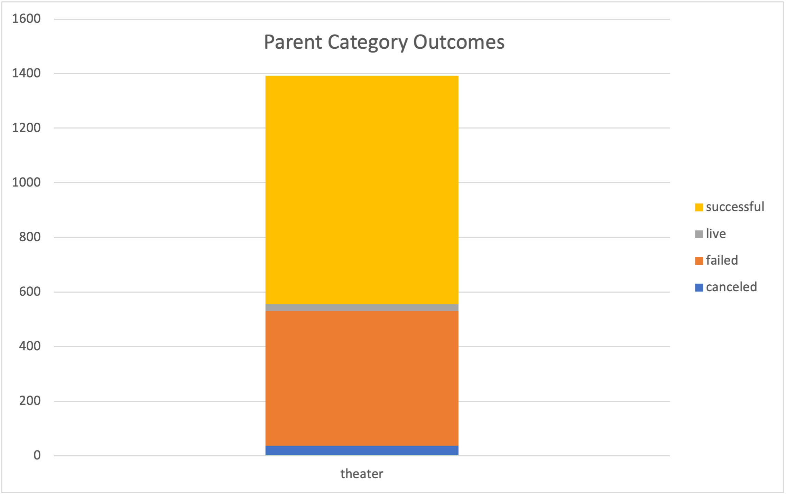

# Kickstarting with Excel
---

## Overview of Project 

This project looks at the outcomes of 4114 fundraising campaigns, and how they fared in relations to their launch dates and finding goals. The fundraising campaign data was collected from 2009 to 2017, across 21 countries and a range of sectors, but the project will be looking particularly at the theatre industry. 

This paper will provide a brief analysis of the outcomes of fundraising campaigns based off of their launch dates, as well as their target goals, as well as provide a brief conclusion about the findings. In addition, it will go over some of the challenges and limitations of working with this dataset, and provide some additional findings which may be useful in this analysis. 

## Purpose 

The aim of this paper is to determine whether fundraising campaigns, in particular those within the theatre industry, were successful at hitting their funding goals. It aims to determine the ideal amount a campaign should set their fundraising goal, and when to launch their campaigns, in order to achieve a successful outcome. 

---

## Analysis and Challenges 

This part of the project provides a brief analysis of the fundraising campaign outcomes, as well as some challenges faced when reviewing the data.

### Analysis of Outcomes Based on Launch Date

The first way the outcomes can be looked at is by launch date. The data can be filtered to view how many campaigns were either success, failed, or were cancelled, by month. The graph below plots the outcomes of all the campaigns and another one for the campaigns in only the theatre industry.

 Image 1

  
   
  

### Analysis of Outcomes Based on Goals

### Challenges and Difficulties Encountered

---

## Results

- #### Conclusions about the Outcomes based on Launch Date

- #### Conclusions about the Outcomes based on Goals

- #### Limitations of this dataset

- #### Additional Info

 
  
