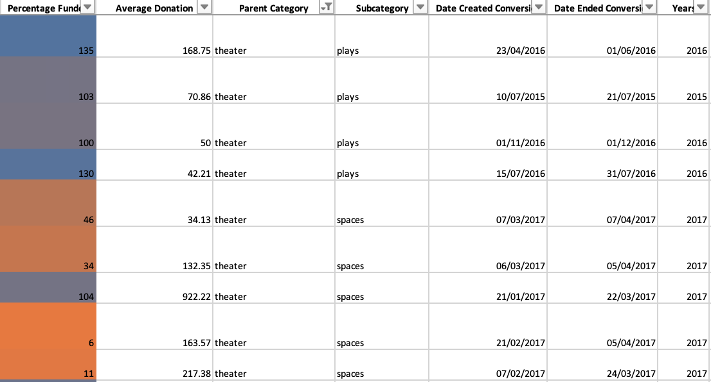
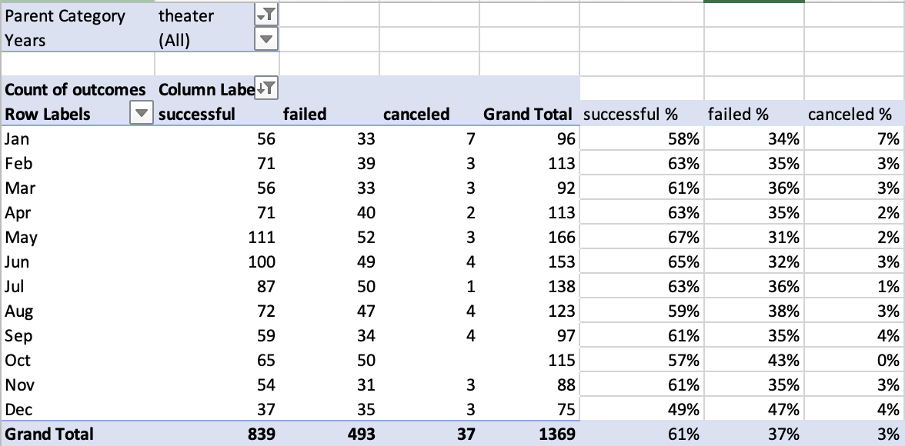

# Kickstarting with Excel
---

## Overview of Project 

This project looks at the outcomes of 4114 fundraising campaigns, and how they fared in relations to their launch dates and finding goals. The fundraising campaign data was collected from 2009 to 2017, across 21 countries and a range of sectors, but the project will be looking particularly at the theatre industry. 

This paper will provide a brief analysis of the outcomes of fundraising campaigns based off of their launch dates, as well as their target goals, as well as provide a brief conclusion about the findings. In addition, it will go over some of the challenges and limitations of working with this dataset, and provide some additional findings which may be useful in this analysis. 

## Purpose 

The aim of this paper is to determine whether fundraising campaigns, in particular those within the theatre industry, were successful at hitting their funding goals. It aims to answer two questions;

  1.	How different campaigns fared in relation to their launch date
  2.	How different campaigns fared in relation to their funding goals  

---

## Analysis and Challenges 

The first challenge to overcome was to sort the raw data. The best way to do this was to create new columns, such as Percentage Funded, Parent Category and Subcategory, and apply a filter to easily organise and filter the data. 

Creating new columns, Date Created Conversion and Date Ended Conversion, using the Data formula changes the Unix timestamps into day-month-year format. This data will be useful in creating pivot tables to analyse campaigns based on dates. 

  

Additionally, `conditional formatting` can be applied to get a quick visual overview of the data. Applied to column ‘Outcomes’, different colours will indicate whether a campaign was successful, failed, cancelled, or is currently live. Applied to column ‘Percentage Funded’, using a colour scale, at a value of 0, the cell colour will be orange, and as the cells value increases, the colour will change to blue. 

Not only is the creation of new columns helpful in analysing data in the raw format, it can also be used to create pivot tables and graphs for better visualisation. 

## Analysis of Outcomes Based on Launch Date

One way the outcomes can be looked at is by launch date. The data can be filtered to view how many campaigns were either success, failed, or were cancelled by month, to see if there’s a trend in fundraising outcomes over the course of a year.

A pivot table provides a helpful summary which is easy to analyse, that is proven useful for of a large amount of data. 

  

This paper aims to analyse the theatre industry in particular, so using the Parent Category filter at the top of the pivot table, we’re able to select the ‘Theater’ Category. 

This pivot table shows May and June were the two months with the greatest number of successful outcomes. By performing a simple calculation to work out the percentage of successful campaigns by month, one can confirm that with the number of failed campaigns taken into account, the months with the highest success rates were May and June. 

To display this visually, a line graph can be inserted using this data. 

  

## Analysis of Outcomes Based on Goals

The other aim of this paper is to look into how successful campaigns were based on their goal amount, looking specifically at the those campaigning for ‘Plays’. 

Using `CountIfs()` in Excel, a table can be created displaying the total number of successful, failed, and cancelled outcomes, for those campaigns in the ‘Plays’ category, for given ranges. 

  

This graphs states that almost 90% of the data collected were for campaigns with goals less than $10,000. Additionally, campaigns with a goal of less than $5000 are the most successful, and campaigns that are over $45,000 are the least successful. 

As looking at outcomes based on launch dates, we can use a line graph to better visualise the data and extract information from it. 

Pic of line graph. 

The line graphs illustrates that goals less than $1000 were the most successful, with 76% success, and goals of $45,000 to $49,999 were the least successful, with 100% failure. 

---

### Challenges and Difficulties Encountered
      
The main challenge was than in order to start a basic analysis the raw data had to be sorted, organised and formatted. This entailed finding formulas such as `Date ` to convert data into readable form (the Unix timestamps), using `IfErrors ` to debug certain formula errors, and `Vlookups` to search for certain data. 

Another challenge was not only creating pivot chart, but deciding which variable to insert into each field in order to extract the data needed for the analysis, and then deciding which chart/graph would be best to visualise the data. 

---

## Conclusions about the Outcomes based on Launch Date

-	May and June are the two months with the most Theatre campaigns being launched, 111 and 110 respectively.
-	These were also the months with the highest percentage of success, with 67% and 65% respectively.
-	December had the fewest number of Theatre campaign launches, but was also the most unsuccessful with almost the same number of successful outcomes and failed ones, 49% and 47% respectively. 

-	The recommendation is that in order to maximise the chances of being successful, Theatre campaigns should choose a launch date of May or June. 

## Conclusions about the Outcomes based on Goals

-	Play campaigns that have a goal of less than $1000 are 76% successful. 
-	Play campaigns that have a goal between $1,000 and $4,999 are 73% successful.  
-	Play campaigns that have a goal of over $45,000 are more likely to fail than succeed, 8% success vs 92% fail. 
-	None of the Play campaigns were cancelled. 

-	The recommendation is that in order to maximise the chances of being successful, Play campaigns should have a goal of less than $5000.  

---

### Limitations of this dataset

-	The sample size of campaigns is 4114 across all industries, 1393 theatre campaigns, and 1066 play campaigns. A larger sample size could provide a smaller margin of error, and would help further identify and outliers that could skew the data. 
-	The data set is from 2009 – 2017. In order to analyse more current trends, a more recent data set will be needed. 
-	90% of data from play campaigns had goals of less than $10,000. Not enough data was collected from campaigns with goals of more than $10,000, making the analysis of campaigns over this amount less accurate. 
-	The data has been collected over multiple countries, meaning their goals would be in their own currency. It is unknown as to how/when goals were converted into USD. 

---

### Recommendations for additional tables/graphs 

-	Make outlier testing and create tables an graphs without outliers. 
-	When looking at goals based on launch date, it could be useful to see results quarterly and/or yearly. 
-	Use launch dates and end dates to find the duration of the campaign and plot a line graph to see if there’s a trench in outcomes vs duration of a campaign. 
-	Using descriptive statistics, such as the table below, to find the means and standard deviations of goal amount vs pledged amount. 

  
